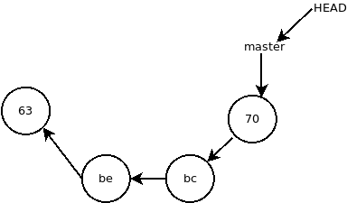
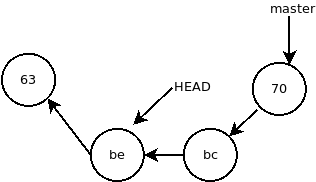
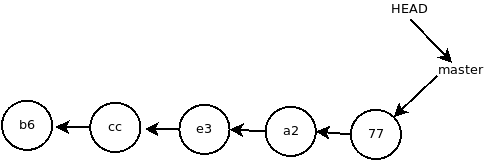
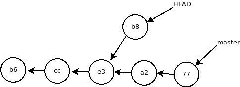
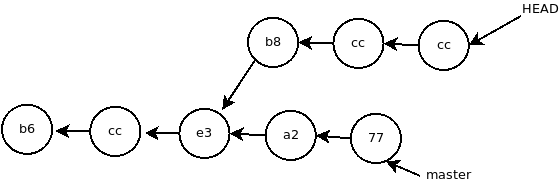
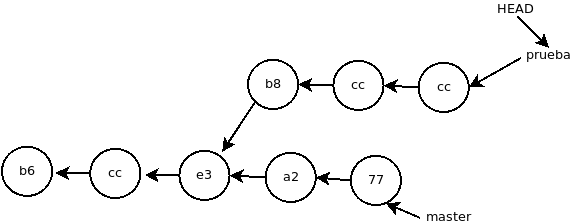
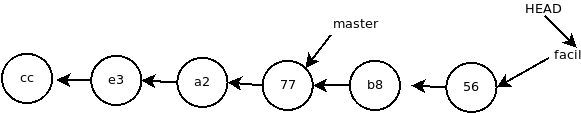
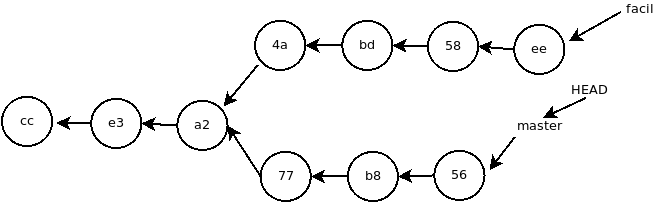
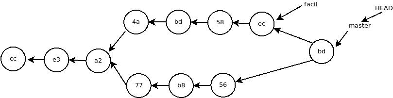

###Git :rocket:

####Inicializar repositorio

`git init`

####Decirle al git que archivos incorporar a la próxima versión

Para pasar ficheros al área de preparación o stage `git add archivo` o `git add .` para incluir todos los ficheros modificados.

####Crear una nueva versión

Se crea un commit `git commit -m "Carga inicial"` y deja el área de preparación o stash vacío.

####Puntero master
Apunta al último commit de la rama.

####Puntero HEAD
Apunta al commit en el que estamos. Por defecto apunta a MASTER.

####GIT LOG

`git log` muestan el log de los commit. `git lg` muestra lo mismo pero con información más resumido.

`git lg`

`d7a2dd8 - (HEAD -> master) Cambio hola por adios (25 hours ago) <Jonatan Cerezuela>`

####GIT SHOW

`git show` muestra commits, se puede utilizar el número de referencia del commit o `master` y `HEAD`.

Además se pueden utilizar ciertos símbolos para localizar commit en relación a otros

`HEAD^` muestra el commit anterior al que apunta el `HEAD` y `HEAD^^` muestra el que está dos posiciones atrás y así tantas veces como haga falta.

Lo mismo con `git show REFERNCIA~1`, `git show REFERNCIA~2`, `git show REFERNCIA~n`

####GIT DIFF

`git diff inicial..final` muestra como pasar de inicial a final.

`git diff final..inicial` muestra como pasar de fianl a inicial.

`git diff fianl --not inicial` muestra como pasar de inicial a final.

`git diff` Cuando se usa sin parámetro se muestra la diferencia entre el directorio de trabajo con el área de preparación. Y si el area de preparación esta limpio se compara con el commit actual.

`git diff --staged` compara lo que haya en el área de preparación con el commit actual

`git diff <commit>` compara el área de trabajo con el commit que tiene el identificador que se la ha pasado en le parámetro.

####GIT CHECKOUT

`git checkout <commit>` mueve el puntero HEAD al commit en cuestión.
Se desacopla de la rama, los commit que se hagan no tendrán repercusión sobre ninguna rama.

Desde esta posicion para ver todos los commit se tendrá que usar el parámetro `--all` del comado log de git `git log --all` de lo contrario solo se verá los commit anteriores.

Para volver a acoplar `HEAD` a la rama tendremos que hacer `checkout` a al puntero `master` y no al último commit de la rama. `git checkout master`

####ANULAR UN COMMIT (REVERTIR)

Se puede anular un commit revirtiendolo. Con `git revert <commit>` se creará un commit inverso al commit de esa forma se anularán los cambios realizados en el commit que queremos anular.

Si en el commit que queremos anular se creaba algún archivo al hacer el revert se borrará.

####GIT RESET

Con git reset podremos hacer desaparecer el último commit, para que el area de trabajo se actualice primaro moveremos `HEAD` al commit anterior y luego `git reset HEAD --hard` o podemos hacerlo en un solo paso `git reset HEAD^ --hard`

El commit sigue existiendo pero se queda flotando sin estar acoplado a ninguna rama, solo se puede acceder a el sabiendo su identificador, en un futuro el recolector de basura de git lo eliminará.

Para evitar que el recolector de basura lo elimine se le puede poner una etiqueta.

####GIT TAG (ETIQUETAS)

`git tag` Lista de etiquetas

`git tag <etiqueta> <commit>` Crea una etiqueta sobre un commit.

`git tag -d <etiqueta>` Elimina la etiqueta, solo la etiqueta.

####CORREGIR UN COMMIT (SOLO EL ÚLTIMO COMMIT)

`git add .`

`git commit --amend -m "Ahora pone antonio"` Con esta orden se sustituye un commit en el que te has equivocado.

Si te equivocas en algo y haces un commit este último commit se puede enmendar. Modificas los ficheros en cuestión, luego haces un `git add .` y despues haces `git commit --amend -m "Ahora pone antonio"` El mensaje del commit debe de ser igual al erroneo.

####CAMBIAR NOMBRE A UN ARCHIVO

Con `git mv <nombre> <nuevoNombre>` se pueden cambiar el nombre de los archivos desde git y automaticamente pasa los cambios al área de preparación.

Idem con `git rm <archivo>`

####DIRECTORIOS

Git no sigue la pista a los directorios nuevos hasta que no tiene contenido ya que no controla directorios si no que controla archivos.

Un truco para que siga una carpeta es crear una archivo vacio y oculto. habitualmente se usa `.gitkeep`.

$`touch .gitkeep`

##RAMAS

Si nos vamos atrás en la rama master y y a partir de un estado antiguo del programa modificamos cosas y hacemos un commit ese commit se queda fuera de esa rama y se queda apuntando al commit antiguo.

Se podria seguir haciendo commits creando una linea alternativa de commits

Para que eso linea no se pierda podemos crear una rama que contendrán esos commits con `git checkout -b <nombre>`.

se puede saltar de rama a rama con `git checkout <rama>`

Una rama es un puntero, eso hace que crear una rama sea instantáneo.

####GIT BRANCH

`git branch` Muestra las ramas disponibles.

`git branch <nombre>` Crea una rama nueva que apunta al commit en el que estás, pero no salta a la rama recién creada.

`git branch -d <rama>` Borra una rama, si estas en la rama que quieres borrar antes tienes que cambiarte a otra rama.

####VER COMMIT DE UNA RAMA

`git diff pepe --not juan` Muestra los commit que están en juan y no están en juan.

####TÉCNICAS PARA FUSIONAR RAMAS (MERGE Y REBASE)

Ante esta situación en la que hay dos ramas `master` y `facil` la forma más sencilla de hacer una fusión es adelantar `master` (fastforward).

En este caso la rama que se va a ver afectada es la rama `master` así que nos pasamos a ella y luego usamos el comando `merge`

`git checkout master`

`git merge facil`

Esta es la forma correcta de  desarrollar un programa. una vez master esta funcionando, creas una nueva rama y pruebas cosas alli como una nueva funcionalidad o arreglar un bug y cuando tengas esa nueva rama cumpliendo la funcionalidad que quieres ya puedes fusionarla con master de forma que en master siempre hay un programa con todas sus funcionalidades completas.

En caso de no interesarte los cambios que se han producido en `facil` desde master y quieres descartarlos puedes pasarte a master y eliminar la rama fácil, los cambios quedarían fuera de ninguna rama y más tarde el recolector de basura se encargara de ellos.

`git checkout master`

`git branch -d facil`

En este caso cuando se fusiona facil con master se usará la técnica recursive, se creará un nuevo commit especial llamado commit de merge el cual apuntará a los último commit de cada rama.

__¡En caso de conflicto!__

Un conflicto ocurre cuando en las dos ramas se tocan en el mismo archivo en la misma linea.
En ese caso dará un error y tendrás que solucionar los conflictos de forma manual.

Al abrir el archivo con conflicto git te habrá marcado el conflicto. Una vez solucionado el conflicto y con el archivo limpio se informa que el archivo esta limpio de conflicto con `git add <archivo>`

Luego de eso el merge aun esta a medio hacer, así que hacemos un commit, escribimos el mensasje y tras ejecutarlo se termina el merge.

Luego borramos la rama prueba, ya no nos sirve para nada.
